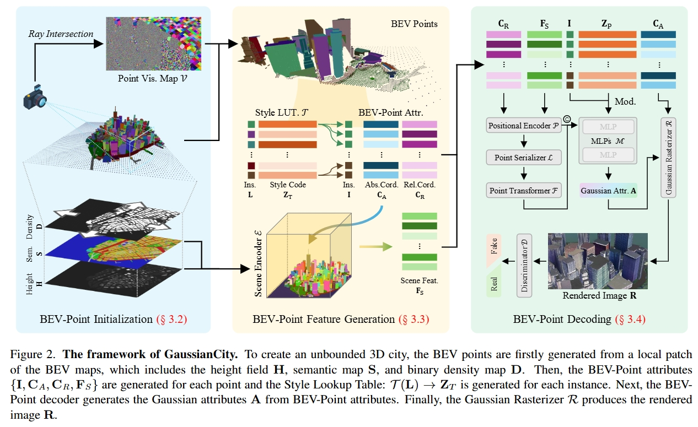

3D Gaussian Splatting Papers Relating to Large-Scale Scene

- [Scene](#3d-gaussian-splatting-papers-relating-to-large-scale-scene)
  - [Street](#Street)
  - [City](#City)
- [Codebase](#codebase)

## Street

### 2024

DeSiRe-GS: 4D Street Gaussians for Static-Dynamic Decomposition and Surface Reconstruction for Urban Driving Scenes

[[paper]](https://arxiv.org/abs/2411.11921)  [[code]](https://github.com/chengweialan/DeSiRe-GS) [[project page]]

method

  

---

Drone-assisted Road Gaussian Splatting with Cross-view Uncertainty

[[paper]](https://arxiv.org/abs/2408.15242)  [[code]](https://github.com/SainingZhang/uc-gs/) [[project page]](https://sainingzhang.github.io/project/uc-gs/)

method

  

---

3D StreetUnveiler with Semantic-Aware 2DGS

[[paper]](https://arxiv.org/abs/2405.18416)  [[code(not yet)]](https://github.com/DavidXu-JJ/StreetUnveiler) [[project page]](https://streetunveiler.github.io/)

method

  

---

StreetSurfGS: Scalable Urban Street Surface Reconstruction with Planar-based Gaussian Splatting

[[paper]](https://arxiv.org/abs/2410.04354)  [[code]] [[project page]]

method

  

---

Extrapolated Urban View Synthesis Benchmark

[[paper]](https://arxiv.org/abs/2412.05256)  [[code]](https://github.com/ai4ce/EUVS-Benchmark/) [[project page]](https://ai4ce.github.io/EUVS-Benchmark/)

method

  

---

EMD: Explicit Motion Modeling for High-Quality Street Gaussian Splatting

[[paper]](https://arxiv.org/abs/2411.15582)  [code(comming soon)] [[project page]](https://qingpowuwu.github.io/emdgaussian.github.io/)

method

  

---

SplatAD: Real-Time Lidar and Camera Rendering with 3D Gaussian Splatting for Autonomous Driving

[[paper]](https://arxiv.org/abs/2411.16816)  [code] [[project page]](https://research.zenseact.com/publications/splatad/)

method

  

---

GSPR: Multimodal Place Recognition Using 3D Gaussian Splatting for Autonomous Driving

[[paper]](https://arxiv.org/abs/2410.00299)  [[code(not yet)]](https://github.com/QiZS-BIT/GSPR) [project page]

method

  

---

DrivingForward: Feed-forward 3D Gaussian Splatting for Driving Scene Reconstruction from Flexible Surround-view Input

[[paper]](https://arxiv.org/abs/2409.12753)  [[code]](https://github.com/fangzhou2000/DrivingForward) [[project page]](https://fangzhou2000.github.io/projects/drivingforward/)

method

  

---

GaussianBeV: 3D Gaussian Representation meets Perception Models for BeV Segmentation[WACV2025]

[[paper]](https://arxiv.org/abs/2407.14108)  [code] [project page]

method

  

---

GaussianFormer: Scene as Gaussians for Vision-Based 3D Semantic Occupancy Prediction[ECCV2024]

[[paper]](https://arxiv.org/abs/2405.17429)  [[code]](https://github.com/huang-yh/GaussianFormer) [project page]

method

  

---

MagicDrive3D: Controllable 3D Generation for Any-View Rendering in Street Scenes

[[paper]](https://arxiv.org/abs/2405.14475)  [[code]](https://github.com/flymin/MagicDrive3D) [[project page]](https://gaoruiyuan.com/magicdrive3d/)

method

  

---

HUGSIM: A Real-Time, Photo-Realistic and Closed-Loop Simulator for Autonomous Driving

[[paper]](https://arxiv.org/abs/2412.01718)  [[code]](https://github.com/hyzhou404/HUGSIM) [[project page]](https://xdimlab.github.io/HUGSIM)

method

  

----

SplatFlow: Self-Supervised Dynamic Gaussian Splatting in Neural Motion Flow Field for Autonomous Driving

[[paper]](https://arxiv.org/abs/2411.15482)  [code] [project page]

method

  

---

OmniRe: Omni Urban Scene Reconstruction

[[paper]](https://arxiv.org/abs/2408.16760)  [[code]](https://github.com/ziyc/drivestudio) [[project page]](https://ziyc.github.io/omnire/)

method

  

---

DHGS: Decoupled Hybrid Gaussian Splatting for Driving Scene

[[paper]](https://arxiv.org/abs/2407.16600)  [code] [[project page]](https://ironbrotherstyle.github.io/dhgs_web/)

method

  

---

S3Gaussian: Self-Supervised Street Gaussians for Autonomous Driving

[[paper]](https://arxiv.org/abs/2405.20323)  [[code]](https://github.com/nnanhuang/S3Gaussian/) [[project page]](https://wzzheng.net/S3Gaussian)

method

  

---

GGRt: Towards Pose-free Generalizable 3D Gaussian Splatting in Real-time[ECCV2024]

[[paper]](https://arxiv.org/abs/2403.10147)  [[code]](https://github.com/lifuguan/GGRt_official) [[project page]](https://3d-aigc.github.io/GGRt/)

method

  

---

DrivingGaussian: Composite Gaussian Splatting for Surrounding Dynamic Autonomous Driving Scenes

[[paper]](https://arxiv.org/pdf/2312.07920.pdf)  [code] [[project page]](https://pkuvdig.github.io/DrivingGaussian/)

method

  

---

Street Gaussians for Modeling Dynamic Urban Scenes

[[paper]](https://arxiv.org/pdf/2401.01339.pdf)  [code] [[project page]](https://zju3dv.github.io/street_gaussians/)

method

  

---

GaussianPro: 3D Gaussian Splatting with Progressive Propagation

[[paper]](https://arxiv.org/abs/2402.14650)  [[code]](https://github.com/kcheng1021/GaussianPro) [[project page]](https://kcheng1021.github.io/gaussianpro.github.io/)

method

  
  

---
Periodic Vibration Gaussian: Dynamic Urban Scene Reconstruction and Real-time Rendering

[[paper]](https://arxiv.org/abs/2311.18561)  [[code]](https://github.com/fudan-zvg/PVG) [[project page]](https://fudan-zvg.github.io/PVG)

method

  
  

---
HUGS: Holistic Urban 3D Scene Understanding via Gaussian Splatting

[[paper]](https://arxiv.org/abs/2403.12722)  [[code(coming soon)]] [[project page]](https://xdimlab.github.io/hugs_website/)

method

  
  

---
HO-Gaussian: Hybrid Optimization of 3D Gaussian Splatting for Urban Scenes

[[paper]](https://arxiv.org/abs/2403.20032)

method

  

---
HGS-Mapping: Online Dense Mapping Using Hybrid Gaussian Representation in Urban Scenes

[[paper]](https://arxiv.org/abs/2403.20159)

method

  

---
SGD: Street View Synthesis with Gaussian Splatting and Diffusion Prior

[[paper]](https://arxiv.org/abs/2403.20079)

method

  

---
TCLC-GS: Tightly Coupled LiDAR-Camera
Gaussian Splatting for Surrounding Autonomous
Driving Scenes

[[paper]](https://arxiv.org/abs/2404.02410)

method

  

---

## City

GaussianCity: Generative Gaussian Splatting for Unbounded 3D City Generation

[[paper]](https://arxiv.org/abs/2406.06526)  [[code]](https://github.com/hzxie/GaussianCity) [[project page]](https://haozhexie.com/project/gaussian-city)

method

  

---

Horizon-GS: Unified 3D Gaussian Splatting for Large-Scale Aerial-to-Ground Scenes

[[paper]](https://arxiv.org/abs/2412.01745)  [[code]] [[project page]](https://city-super.github.io/horizon-gs/)

method

  

---

VastGaussian: Vast 3D Gaussians for Large Scene Reconstruction

[[paper]](https://arxiv.org/abs/2402.17427)  [code(soon)] [[project page]](https://vastgaussian.github.io/)

method

  
  

---
CityGaussian: Real-time High-quality Large-Scale Scene Rendering with Gaussians

[[paper]](https://arxiv.org/abs/2404.01133)  [code(soon)] [[project page]](https://dekuliutesla.github.io/citygs/)

method

  
  

---

# Survey
3D Gaussian as a New Vision Era: A Survey

[paper](https://arxiv.org/abs/2402.07181)

---
Forging Vision Foundation Models for Autonomous Driving: Challenges, Methodologies, and Opportunities

[paper](https://arxiv.org/abs/2401.08045)

# Codebase

[3dgs](https://github.com/graphdeco-inria/gaussian-splatting)

[GauStudio: A Modular Framework for 3D Gaussian Splatting and Beyond](https://github.com/GAP-LAB-CUHK-SZ/gaustudio
)

# Other

[awesome-3d-gaussian-splatting](https://github.com/MrNeRF/awesome-3D-gaussian-splatting)

