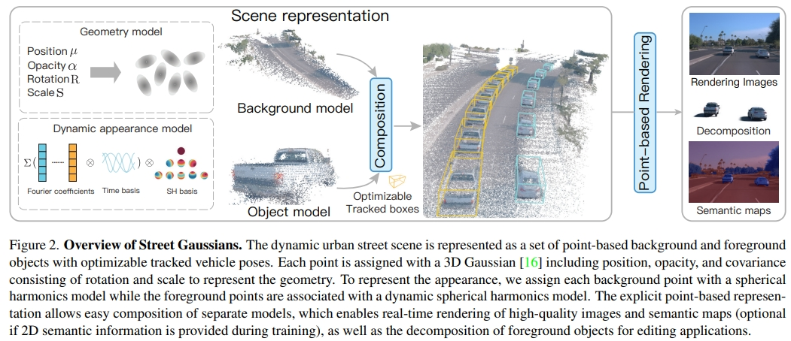

3D Gaussian Splatting Papers Relating to Large-Scale Scene

- [Scene](#3d-gaussian-splatting-papers-relating-to-large-scale-scene)
  - [Street](#Street)
  - [City](#City)
- [Codebase](#codebase)

## Street

DrivingGaussian: Composite Gaussian Splatting for Surrounding Dynamic Autonomous Driving Scenes

[[paper]](https://arxiv.org/pdf/2312.07920.pdf)  [code] [[project page]](https://pkuvdig.github.io/DrivingGaussian/)

method

  

---

Street Gaussians for Modeling Dynamic Urban Scenes

[[paper]](https://arxiv.org/pdf/2401.01339.pdf)  [code] [[project page]](https://zju3dv.github.io/street_gaussians/)

method

  

---

GaussianPro: 3D Gaussian Splatting with Progressive Propagation

[[paper]](https://arxiv.org/abs/2402.14650)  [[code]](https://github.com/kcheng1021/GaussianPro) [[project page]](https://kcheng1021.github.io/gaussianpro.github.io/)

method

  
  

## City

VastGaussian: Vast 3D Gaussians for Large Scene Reconstruction

[[paper]](https://arxiv.org/abs/2402.17427)  [code(soon)] [[project page]](https://vastgaussian.github.io/)

method

  
  

# Codebase

[3dgs](https://github.com/graphdeco-inria/gaussian-splatting)

# Other

[awesome-3d-gaussian-splatting](https://github.com/MrNeRF/awesome-3D-gaussian-splatting)

